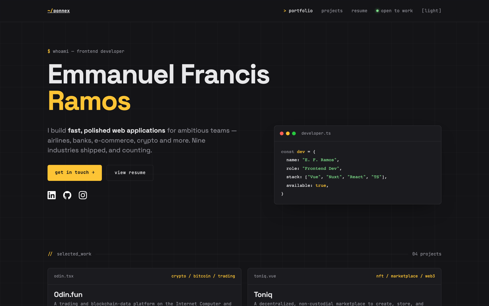
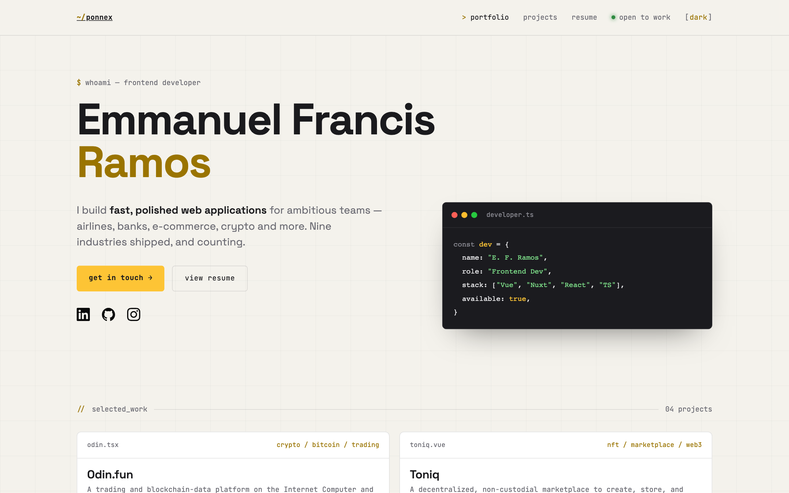
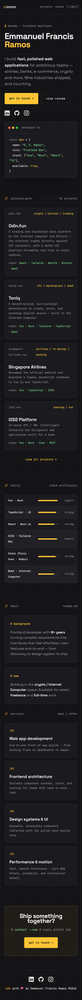
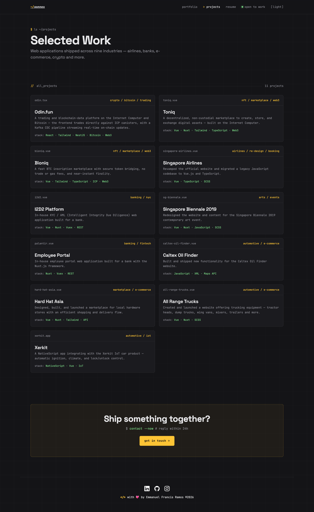

[](https://app.netlify.com/sites/ponnex-portfolio/deploys)

# ponnex-portfolio

> Personal portfolio of **Emmanuel Francis Ramos** — frontend developer. A terminal / engineer-themed single-page site built with Nuxt 4 and Vue 3.



## Themes

A single switch flips the whole site — nav, sections, and footer — between a dark terminal palette and a light "paper" palette, driven entirely by CSS custom properties.

| Dark | Light |
| --- | --- |
|  |  |

## Responsive

Fully responsive down to ~320px. Content keeps consistent side margins, the nav collapses to a single row, and the résumé PDF scales to the viewport.



## Pages

- **Home** (`/`) — hero, selected work, skills, about, and contact sections.
- **Projects** (`/projects`) — full list of selected work, seeded from [`app/data/projects.ts`](app/data/projects.ts).
- **Résumé** (`/resume`) — embedded PDF (lazy-loaded via `vue-pdf-embed`) with download and LinkedIn links.
- **Thank you** (`/thankyou`) — post-contact-form confirmation.



## Tech Stack

- [Nuxt 4](https://nuxt.com) / [Vue 3](https://vuejs.org) (`<script setup>`), client-rendered SPA (`ssr: false`)
- [VueUse](https://vueuse.org) (`@vueuse/nuxt`)
- SCSS with CSS-custom-property theming
- [`vue-pdf-embed`](https://github.com/hrynko/vue-pdf-embed) for the résumé
- Self-hosted fonts: JetBrains Mono, Space Grotesk, Menlo
- TypeScript, deployed on Netlify

## Project Structure

```
app/
  assets/style/      # SCSS — _terminal.scss is the design system; _variables.scss holds tokens
  components/        # navbar, footer, sections (work/skills/about/contact), social-icons
  data/              # projects.ts, skills.ts — content lives here
  layouts/           # default, thankyou
  pages/             # index, projects, resume, thankyou
public/              # favicon, resume PDF, icons
```

To update content, edit the data files in [`app/data/`](app/data/) rather than the components.

## Build Setup

```bash
# install dependencies
$ npm install

# serve with hot reload at localhost:3000
$ npm run dev

# build for production and preview the server
$ npm run build
$ npm run preview

# generate static project
$ npm run generate
```

Requires Node — see [`.nvmrc`](.nvmrc) for the pinned version (`nvm use`).

For a detailed explanation of how things work, check out the [Nuxt docs](https://nuxt.com/docs).
